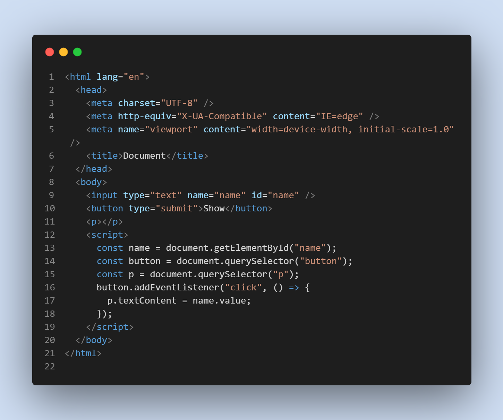

# Basic Question

### "1" + 1 + 1 = ? in JavaScript

"111" in JavaScript

### JavaScript Selector Methed:

- document.querySelectorAll(".example"); // return NodeList and dot(.) for class and # for id selector
- document.querySelector("p");
- document.getElementById("demo");
- document.getElementsByClassName("demo");
- document.getElementsByTagName("demo");
- document.getElementsByName("demo");

### Input field er value k onno element a show korano



### JQuery To popup making:


- Button Text Changing with JQuery depends on the value of box visibility but need to add a class on button btn:

```javascript
$(".btn").text($(".box").is(":visible") ? "Hide" : "Show");
```

### OOP Main Properties:

These four properties are the main properties of OOP. They are:

- Polymorphism
- Encapsulation
- Abstraction
- Inheritance.

### img Syntax in HTML

```HTML

```

### Depth first traversal:

(a) Inorder (Left, Root, Right) : 4 2 5 1 3
(b) Preorder (Root, Left, Right) : 1 2 4 5 3
(c) Postorder (Left, Right, Root) : 4 5 2 3 1
