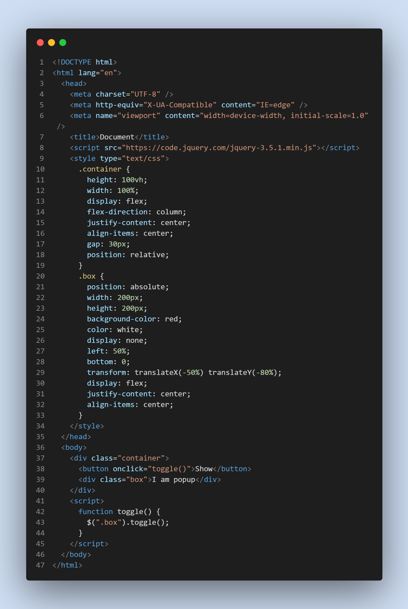

# Basic Question

### "1" + 1 + 1 = ? in JavaScript

"111" in JavaScript

### JavaScript Selector Methed:

- document.querySelectorAll(".example"); // return NodeList and dot(.) for class and # for id selector
- document.querySelector("p");
- document.getElementById("demo");
- document.getElementsByClassName("demo");
- document.getElementsByTagName("demo");
- document.getElementsByName("demo");

### Input field er value k onno element a show korano


### JQuery To popup making:



- Button Text Changing with JQuery depends on the value of box visibility but need to add a class on button btn:

```javascript
$(".btn").text($(".box").is(":visible") ? "Hide" : "Show");
```

### OOP Main Properties:

These four properties are the main properties of OOP. They are:

- Polymorphism
- Encapsulation
- Abstraction
- Inheritance.

### img Syntax in HTML

```HTML

```

### Depth first traversal:

(a) Inorder (Left, Root, Right) : 4 2 5 1 3
(b) Preorder (Root, Left, Right) : 1 2 4 5 3
(c) Postorder (Left, Right, Root) : 4 5 2 3 1

### BitWise Operator IN CPP:

Example :
a = 00000101 (5 in decimal)
b = 00001001 (9 in decimal)

- & (bitwise AND) -> a & b = 00000001 (1 in decimal)
- | (bitwise OR) -> a | b = 00001101 (13 in decimal)
- ^ (bitwise XOR) -> a ^ b = 00001100 (12 in decimal)
- << (left shift) -> a << 1 = 00001010 (10 in decimal)
- &gt;&gt; (right shift) -> a >> 1 = 00000010 (2 in decimal)
- ~ (bitwise NOT) -> ~a = 11111010 (-6 in decimal)

### Having Clauses in SQL:

```SQL
SELECT column_name(s)
FROM table_name
WHERE condition
GROUP BY column_name(s)
HAVING condition
ORDER BY column_name(s);
```

```SQL
SELECT COUNT(CustomerID), Country
FROM Customers
GROUP BY Country
HAVING COUNT(CustomerID) > 5;
```

### GROUP By Clause in SQL:

```SQL
SELECT column_name(s)
FROM table_name
WHERE condition
GROUP BY column_name(s)
ORDER BY column_name(s);
```

```SQL
SELECT COUNT(CustomerID), Country
FROM Customers
GROUP BY Country;
```

### SQL WHERE Clause:

```SQL
SELECT column1, column2, ...
FROM table_name
WHERE condition;
```

```SQL
SELECT * FROM Customers
WHERE Country='Mexico';
```

### JS er code kivabe run hoye thake?

JavaScript is an interpreted language. This means we do not have to compile the JavaScript source code before sending it to the browser. An interpreter can take the raw JavaScript code and run it for you.
<strong>V8</strong> is one of the most popular JavaScript engines, perhaps because it is developed by Google. But the V8 engine is constantly evolving and becoming faster. Apart from Google Chrome, Chromium project, Electron.js, and server-side JavaScript runtime Node.js use the V8 engine.
