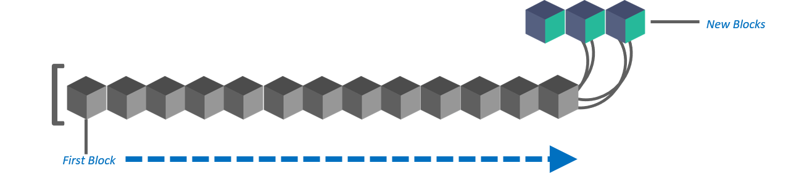
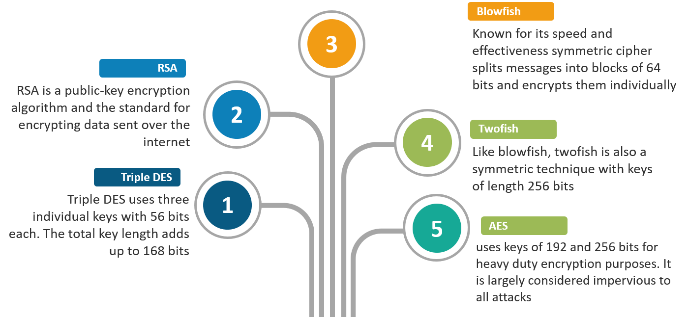

## Blockchain Related Question

### Q 1. What do you know about Blockchain? What is the difference between Bitcoin blockchain and Ethereum blockchain?

Ans: The blockchain is a decentralized distributed database of immutable records. The technology was discovered with the invention of Bitcoins(the first cryptocurrency). It’s a trusted approach and there are a lot of companies in the present scenario which are using it. As everything is secure, and because it’s an open-source approach, it can easily be trusted in the long run.
|Topics|Bitcoin|Ethereum|
|---|---|---|
|Concept|Digital Currency|Smart Contracts|
|Founder| Satoshi Nakamoto |Vitalik Buterin|
|Release Method| Genesis Block Mined |Presale|
|Cryptocurrency Used |Bitcoin(Satoshi)| Ether|
|Algorithm |SHA-256| Ethash|
|Blocks Time| 10 Minutes| 12-14 Seconds|
|Scalable |Not yet| Yes|

### Q 2. What is the principle on which blockchain technology is based on?

Ans: It enables the information to be distributed among the users without being copied.

### Q3 What are the different types of Blockchains?

Ans:

- [x] Public Blockchain
- [x] Private Blockchain
- [x] Consortium Blockchain

###Q 4. Why is Blockchain a trusted approach?
Ans:

- Blockchain can be trusted due to so many reasons.
- Its compatibility with other business applications due to its open-source nature.
- Its security. As it was meant for online transactions, the developers have paid special attention to keeping up the pace when it comes to its security.
- It really doesn’t matter what type of business one owns, Blockchain can easily be considered.

### Q 5. Name the two types of records that are present in the blockchain database?

Ans: These records are block records and transactional records. Both these records can easily be accessed, and the best thing is, it is possible to integrate them with each other without following the complex algorithms.

### Q 6. Blockchain is a distributed database. How does it differ from traditional databases?

Ans:
|Properties|Blockchain|Traditional Database|
|---|---|---|
|Operations|Only Insert Operations|Can perform C.R.U.D. operations|
|Replication|Full Replication of block on every peer|Master Slave or Multi-Master |
|Consensus|Majority of peers agree on the outcome of transactions| Distributed Transactions (2 phase commit)|
|Invariants|Anybody can validate transactions across the network|Integrity Constraints|

### Q 7. What are the properties of Blockchain?

Ans: <b>There are four key features of blockchain:</b>

- Decentralized Systems
- Distributed ledger
- Safer & Secure Ecosystem
- Minting

### Q 8. What is encryption? What is its role in Blockchain?

Ans: Data security always matters. Encryption is basically an approach that helps organizations to keep their data secure.

The encrypted data is encoded or changed up to some extent before it is sent out of a network by the sender and only authorized parties can access that information.In Blockchain, this approach is useful because it simply adds more to the overall security and authenticity of blocks and helps to keep them secure.

### Q 9. What do you mean by blocks in blockchain technology?

Ans: Blockchain consists of a list of records. Such records are stored in blocks. These blocks are in turn linked with other blocks and hence constitute a chain called Blockchain.

### Q 10. How does a block is recognized in the Blockchain approach?

Ans: Every block in this online ledger basically consists of a hash pointer which acts as a link to the block which is prior to it, transaction data and in fact a stamp of time.

### Abbreaviations

RSA -> Rivest Shamir Adleman Algorithm
DES -> Data Encryption Standard
AES -> Advanced Encryption Standard
SHA -> Secure Hash Algorithm
MD5 -> Message Digest 5
ECDSA -> Elliptic Curve Digital Signature Algorithm
ECIES -> Elliptic Curve Integrated Encryption Scheme
ECC -> Elliptic Curve Cryptography
ECDH -> Elliptic Curve Diffie Hellman
ECDLP -> Elliptic Curve Discrete Logarithm Problem

### Widely used cryptographic algorithms

RSA -> Rivest Shamir Adleman Algorithm. It is a public key algorithm. It is used for encryption and decryption of data. It is used for digital signatures. It is used for key exchange. It is used for authentication. It is used for digital certificates. It is used for digital signatures. It is used for key exchange. It is used for authentication. It is used for digital certificates.

DES -> Data Encryption Standard. It is a symmetric key algorithm. It is used for encryption and decryption of data. It is used for digital signatures. It is used for key exchange. It is used for authentication. It is used for digital certificates. It is used for digital signatures. It is used for key exchange. It is used for authentication. It is used for digital certificates.

AES -> Advanced Encryption Standard. It is a symmetric key algorithm. It is used for encryption and decryption of data. It is used for digital signatures. It is used for key exchange. It is used for authentication. It is used for digital certificates. It is used for digital signatures. It is used for key exchange. It is used for authentication. It is used for digital certificates.

Triple DES -> It is a symmetric key algorithm. It is used for encryption and decryption of data. It is used for digital signatures. It is used for key exchange. It is used for authentication. It is used for digital certificates. It is used for digital signatures. It is used for key exchange. It is used for authentication. It is used for digital certificates.

SHA -> Secure Hash Algorithm. It is a one way hash function. It is used for encryption and decryption of data. It is used for digital signatures. It is used for key exchange. It is used for authentication. It is used for digital certificates. It is used for digital signatures. It is used for key exchange. It is used for authentication. It is used for digital certificates.

MD5 -> Message Digest 5. It is a one way hash function. It is used for encryption and decryption of data. It is used for digital signatures. It is used for key exchange. It is used for authentication. It is used for digital certificates. It is used for digital signatures. It is used for key exchange. It is used for authentication. It is used for digital certificates.
